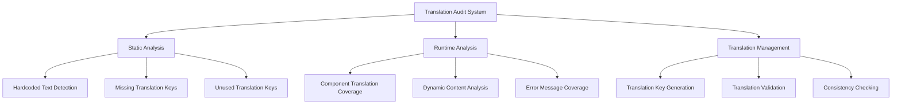

# Design Document

## Overview

This design outlines a comprehensive solution to audit and fix translation issues across all navigation panel pages in the LPG Distributor Management System. The system currently has a solid internationalization foundation with English and Bengali translations, but requires systematic fixes to ensure complete coverage and consistency.

The solution will leverage the existing translation infrastructure while implementing automated tools and processes to identify, fix, and prevent future translation issues.

## Architecture

### Current Translation System Analysis

The application already has a well-structured i18n system:

- **Translation Interface**: `Translations` interface in `src/lib/i18n/translations.ts`
- **Translation Files**: English and Bengali translations in the same file
- **Context Provider**: `SettingsContext` provides `t()` function for components
- **Language Switching**: Settings page allows language switching
- **Fallback System**: Falls back to English if translation missing

### Translation Audit Architecture



### Page-by-Page Translation Strategy

Each navigation page will be systematically audited and fixed:

1. **Dashboard** - Main dashboard with stats and navigation cards
2. **Sales** - Sales forms, tables, and analytics
3. **Analytics** - Charts, metrics, and analysis components
4. **Daily Sales Report** - Report tables and filters
5. **Inventory** - Stock tables, alerts, and management forms
6. **Shipments** - Purchase orders, shipment tracking
7. **Drivers** - Driver management tables and forms
8. **Users** - User management interface (already mostly translated)
9. **Receivables** - Payment tracking tables
10. **Assets** - Asset management forms
11. **Expenses** - Expense tracking and categorization
12. **Reports** - Various report interfaces
13. **Product Management** - Product configuration
14. **Settings** - System configuration interface

## Components and Interfaces

### Translation Audit Tool

```typescript
interface TranslationAuditResult {
  page: string;
  component: string;
  issues: TranslationIssue[];
  coverage: number;
  status: 'complete' | 'partial' | 'missing';
}

interface TranslationIssue {
  type: 'hardcoded' | 'missing_key' | 'untranslated' | 'formatting';
  location: string;
  text: string;
  suggestedKey?: string;
  priority: 'high' | 'medium' | 'low';
}
```

### Enhanced Translation System

```typescript
// Extended translation interface for new keys
interface ExtendedTranslations extends Translations {
  // Page-specific translations
  salesPage: {
    addSale: string;
    saleDetails: string;
    customerInfo: string;
    // ... more sales-specific keys
  };

  inventoryPage: {
    stockLevel: string;
    reorderPoint: string;
    lastRestocked: string;
    // ... more inventory-specific keys
  };

  // Common UI elements
  common: {
    loading: string;
    error: string;
    success: string;
    noDataFound: string;
    // ... more common keys
  };
}
```

### Translation Validation System

```typescript
interface TranslationValidator {
  validateKey(key: string): boolean;
  validateTranslation(
    key: string,
    value: string,
    locale: string
  ): ValidationResult;
  checkConsistency(
    translations: Record<string, Translations>
  ): ConsistencyReport;
  generateMissingKeys(sourceLocale: string, targetLocale: string): string[];
}
```

## Data Models

### Translation Coverage Tracking

```typescript
interface PageTranslationStatus {
  pageId: string;
  pageName: string;
  totalElements: number;
  translatedElements: number;
  coverage: number;
  lastAuditDate: Date;
  issues: TranslationIssue[];
}

interface ComponentTranslationMap {
  componentPath: string;
  translationKeys: string[];
  hardcodedTexts: string[];
  dynamicContent: string[];
}
```

### Translation Key Management

```typescript
interface TranslationKeyMetadata {
  key: string;
  category: 'navigation' | 'form' | 'table' | 'message' | 'action';
  usage: string[]; // List of components using this key
  context: string;
  priority: 'critical' | 'important' | 'optional';
}
```

## Error Handling

### Translation Error Recovery

1. **Missing Key Fallback**: Display English translation or key name
2. **Invalid Translation**: Log error and use fallback
3. **Loading Failures**: Use cached translations
4. **Format Errors**: Sanitize and display safe version

### Error Logging and Monitoring

```typescript
interface TranslationError {
  type: 'missing_key' | 'invalid_format' | 'loading_failed';
  key: string;
  locale: string;
  component: string;
  timestamp: Date;
  fallbackUsed: string;
}
```

## Testing Strategy

### Automated Translation Testing

1. **Static Analysis Tests**
   - Scan for hardcoded strings in JSX
   - Verify all translation keys exist
   - Check translation key consistency

2. **Runtime Translation Tests**
   - Test language switching functionality
   - Verify all UI elements update on language change
   - Test fallback behavior

3. **Visual Regression Tests**
   - Screenshot comparison for different languages
   - Layout validation for longer translations
   - UI component overflow detection

### Manual Testing Checklist

1. **Page-by-Page Verification**
   - Navigate to each page in both languages
   - Verify all text is translated
   - Check form validation messages
   - Test error scenarios

2. **User Flow Testing**
   - Complete user workflows in both languages
   - Test language switching mid-workflow
   - Verify data formatting (dates, numbers, currency)

### Translation Quality Assurance

1. **Content Review Process**
   - Native speaker review for Bengali translations
   - Technical terminology validation
   - Cultural appropriateness check

2. **Consistency Validation**
   - Terminology consistency across pages
   - UI element naming consistency
   - Message tone and style consistency

## Implementation Approach

### Phase 1: Audit and Analysis

- Create automated tools to scan for translation issues
- Generate comprehensive report of current state
- Prioritize fixes based on user impact

### Phase 2: Core Translation Fixes

- Fix hardcoded text in high-priority components
- Add missing translation keys
- Update translation files with new keys

### Phase 3: Page-by-Page Implementation

- Systematically fix each navigation page
- Test translation coverage for each page
- Validate language switching functionality

### Phase 4: Quality Assurance and Testing

- Comprehensive testing across all pages
- Translation quality review
- Performance impact assessment

### Phase 5: Maintenance and Monitoring

- Set up automated translation validation
- Create developer guidelines for translations
- Implement continuous monitoring

## Technical Considerations

### Performance Impact

- Translation loading optimization
- Lazy loading for large translation files
- Caching strategy for translations

### Developer Experience

- Clear guidelines for adding new translations
- Automated tools for translation key generation
- IDE integration for translation validation

### Scalability

- Support for additional languages in the future
- Modular translation file structure
- Automated translation workflow integration

## Success Metrics

1. **Coverage Metrics**
   - 100% translation coverage across all navigation pages
   - Zero hardcoded text in production code
   - Complete fallback system implementation

2. **Quality Metrics**
   - Native speaker approval for all translations
   - Zero layout breaks when switching languages
   - Consistent terminology usage

3. **Performance Metrics**
   - No performance degradation from translation system
   - Fast language switching (< 100ms)
   - Efficient translation loading

4. **Maintenance Metrics**
   - Automated detection of new translation needs
   - Developer compliance with translation guidelines
   - Reduced translation-related bugs
