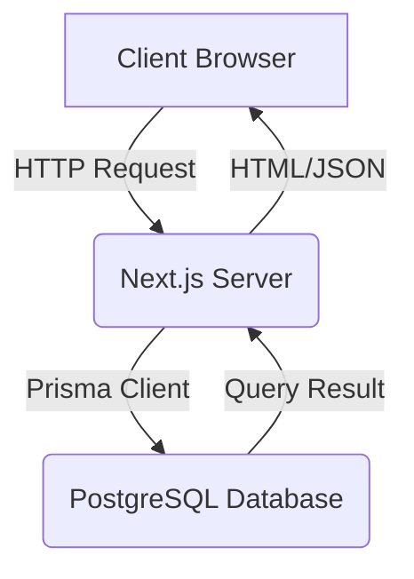

# Application Architecture

This document provides an overview of the architecture of the LPG Distributor SaaS application.

## 1. Technology Stack

*   **Framework:** Next.js with App Router
*   **Language:** TypeScript
*   **Database:** PostgreSQL
*   **ORM:** Prisma
*   **Authentication:** NextAuth.js
*   **UI:** React, Tailwind CSS
*   **Validation:** Zod

## 2. Project Structure

The project is organized into the following main directories:

*   `src/app`: Contains the application's pages and API routes.
*   `src/components`: Contains reusable React components, organized by feature.
*   `src/lib`: Contains utility functions, database clients, and business logic.
*   `src/prisma`: Contains the Prisma schema and migrations.
*   `src/public`: Contains static assets like images and fonts.

## 3. Data Flow

The application follows a typical client-server architecture, with the Next.js application acting as both the frontend and the backend.



## 4. Authentication and Authorization

Authentication is handled by NextAuth.js using a `CredentialsProvider` for email and password authentication. Sessions are managed using JWTs.

Authorization is implemented using a combination of middleware and role-based access control (RBAC):

*   **Middleware:** Protects routes and redirects unauthenticated users to the login page.
*   **RBAC:** The user's role is stored in the JWT and used to control access to specific routes and resources.

## 5. Key Components

*   **Multi-tenancy:** The application is a multi-tenant SaaS, with the `Tenant` model being central to the architecture.
*   **Business Logic:** The `src/lib/business` directory contains the core business logic for the application, including inventory management, receivables, and sales.
*   **API Routes:** The `src/app/api` directory contains the backend API endpoints, which are well-structured and correspond to the different resources in the application.
*   **UI Components:** The `src/components` directory contains a rich set of reusable UI components, which helps to ensure a consistent look and feel across the application.

## 6. Architecture Diagram

```mermaid
graph TD
    subgraph "Client"
        A[Browser]
    end

    subgraph "Server (Next.js)"
        B[Next.js App]
        C[API Routes]
        D[Middleware]
        E[NextAuth.js]
        F[Prisma Client]
    end

    subgraph "Database"
        G[PostgreSQL]
    end

    A -->|HTTP Request| B
    B -->|Renders| A
    B -->|API Request| C
    C -->|Authentication| E
    C -->|Authorization| D
    C -->|Database Query| F
    F -->|SQL| G
    G -->|Data| F
    F -->|Data| C
    C -->|JSON| B